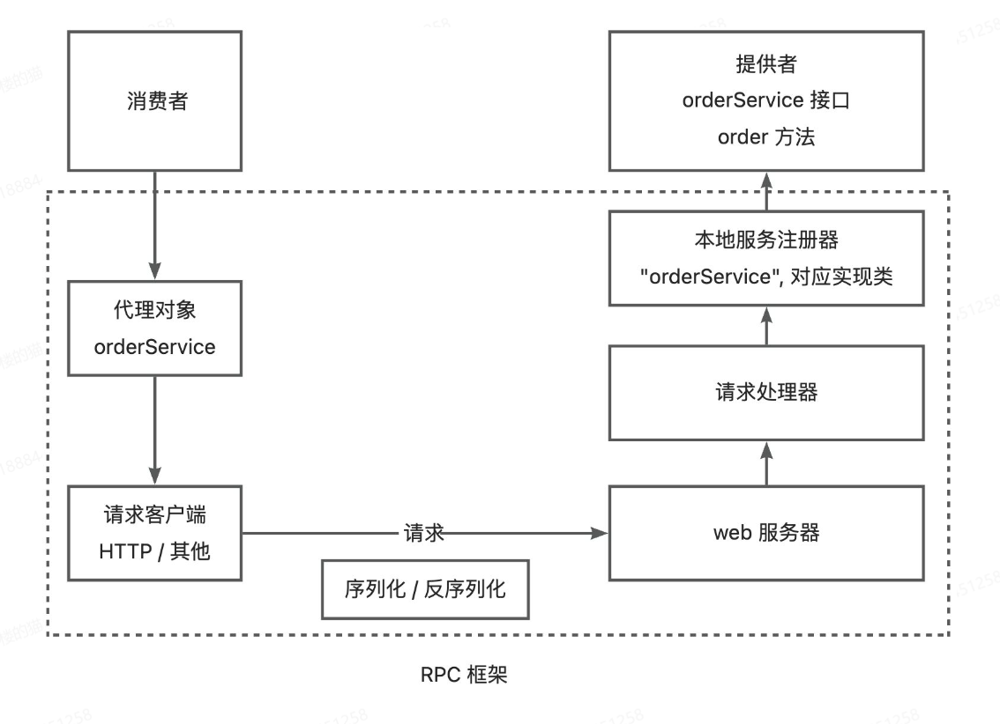
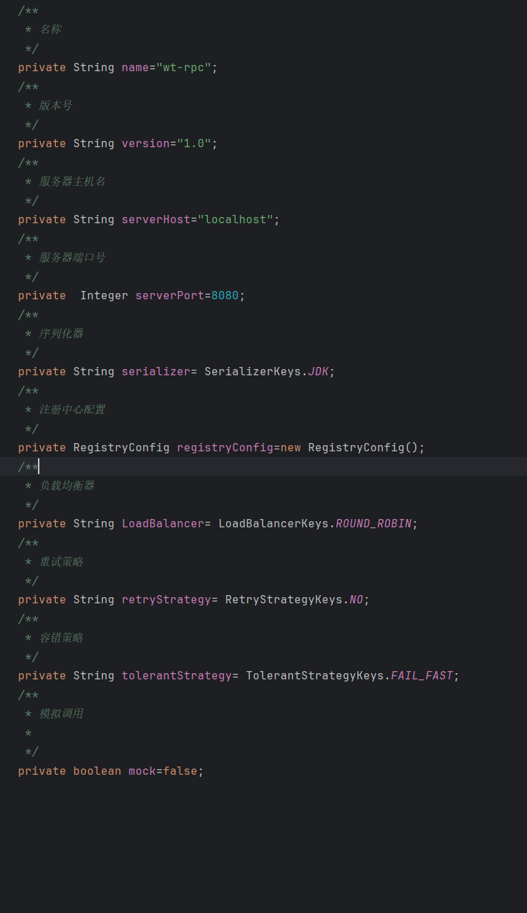
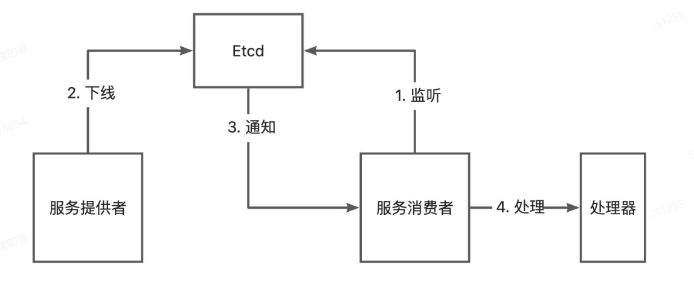
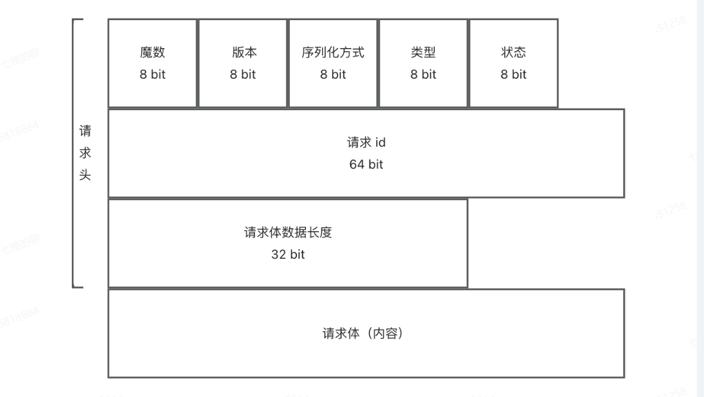
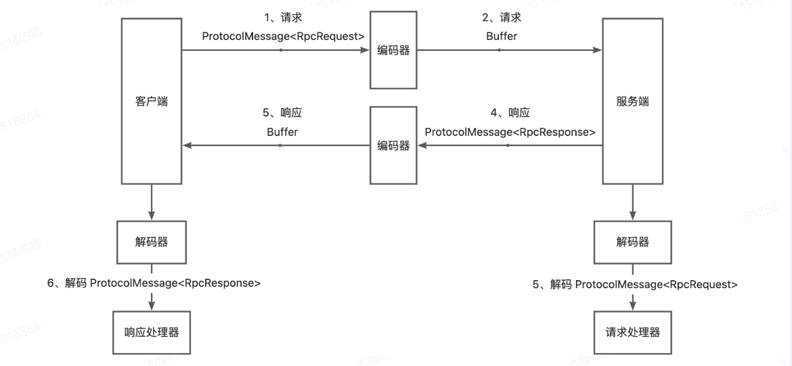

#### 框架基本介绍

**RPC定义**：RPC（Remote Procedure Call）远程调用，是一种计算机通信协议，允许程序在不同的计算机之间进行通信和交互，就像本地调用一样

**简易框架示意图**：

## RPC：框架扩展

**1、支持自定义全局配置加载，支持在 [application.properties](example-comsumer\src\main\resources\application.properties) 内配置RPC相关值**

​	涉及相关的类为ConfigUtils。全局的配置对象，通过单例模式来维护。

​	支持字段如下：类（C）

**2、支持Mock接口，通过配置mock变量来开启和关闭**

**3、通过SPI动态支持多种序列化器（JSON、Kryo、Hessian  默认为JSON）**

​	使用spi机制，实现SpiLoader加载器，动态根据需要，动态加载具体使用类，（spiLoader加载器，在框架加载时就进行加载，缓存类信息）

​	序列化器通过使用工厂+单例来实现创建和获取对象。

**4、支持配置和扩展注册中心（支持redis、Etcd）**

​	注册中心可以根据服务提供者动态提供服务提供者信息（名称，ip地址等），对于服务消费者来说，可提供订阅服务，当服务下线时提供通知。

​	注册中心支持心跳检测和续期机制（CronUtils.schedule 定期续约），

​	服务信息缓存机制。（主要使用Etcd watch监听器保证缓存一致）

​	如图所示：

##### 5、底层网络采取自定义网络协议来替代http协议

​     自定义字段如下：

​	TCP服务收发对象使用Buffer类型，需要使用编码器和解码器，功能如图所示：

**6、支持服务负载均衡**

​	轮询负载均衡器 RoundRobinLoadBalancer 

​	随机负载均衡器 RandomLoadBalancer

​	一致性Hash 负载均衡器 ConsistentHashLoadBalancer(采用一致性hash算法)

​		支持填写自定义配置即可更改负载均衡器（使用spi机制动态修改加载类）

**7、支持重试机制**

​	不重试 NoRetryStrategy

​	固定时间重试 FixedIntervalRetryStrategy

**8、支持容错机制**

​	快速失败容错 FailFastTolerantStrategy

​	静默处理 FailSafeTolerantStrategy

​	服务降级策列
